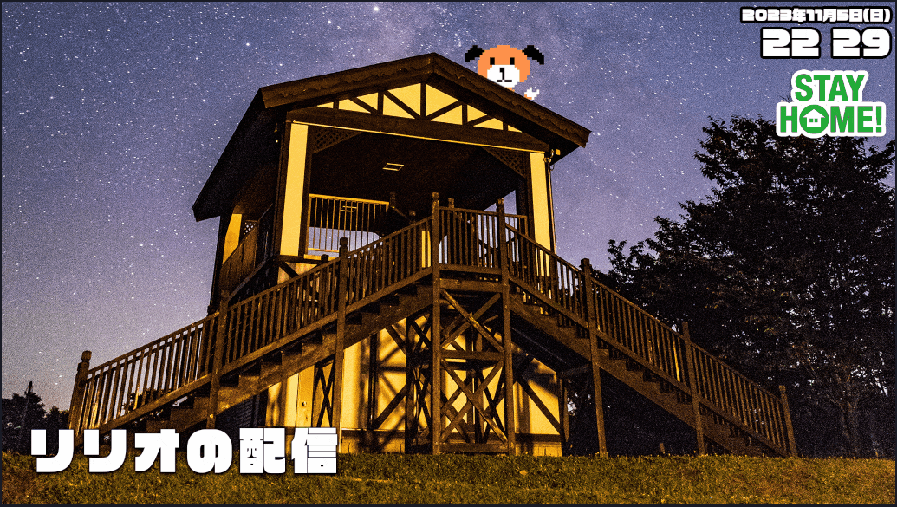

<p align="center">
  <a href="https://github.com/ririo08/please-subscribe" target="_blank" rel="noopener noreferrer">
    
  </a>
</p>

<h1 align="center">Please Subscribe Overlay</h1>

<p align="center">
チャンネル登録を促す配信向け表示オーバーレイ
</p>

<p align="center">
  
  <a href="https://github.com/ririo08/please-subscribe/actions/workflows/ci_main.yml">
    
  </a>
</p>

<br />

<p align="center">
  <a href="https://github.com/ririo08/please-subscribe" target="_blank" rel="noopener noreferrer" >
    
  </a>
</p>

## これは何？

定期的にチャンネル登録を促す宣伝文章を表示することができるオーバーレイです。  
現在は 10 分に一度、10 秒間チャンネル登録を促す文章を表示後、現在のチャンネル登録者数を表示することができるようになっています。  
チャンネル登録をしてほしい旨を一々伝えるのが面倒だったので作成してみました。

## 使い方

現在ベータ版になります。

1. Google API key と YouTube のチャンネル ID が必要になるので用意します
1. それぞれの値を項目に入力後、リンク生成ボタンを押下します
1. 生成した URL をコピーし、OBS に貼り付け

値が間違っている場合は開いても何も表示されません。正しい場合は表示直後から文章が表示されるようになっています。

## 利用規約

基本的には MIT ライセンスとしていますが、可能であれば以下の文章を説明欄に貼っていただけるととても喜びます。

```
チャンネル登録喚起オーバーレイ
https://ririo.dev/please-subscribe/
```

## コントリビュート

issue, PR 等大歓迎です！  
なにか不明な点や気になる点がありましたら Issue またはリリオのツイッターや YouTube までご連絡ください。

## Setup

Deveropment:

```cmd
yarn
yarn dev
```

Build:

```
yarn generate
```

## Testing

今のところ未実装(API の取得処理で実装が必要かな…)

## コントリビューﾀ

<a href="https://github.com/ririo08/please-subscribe/graphs/contributors">
  
</a>
